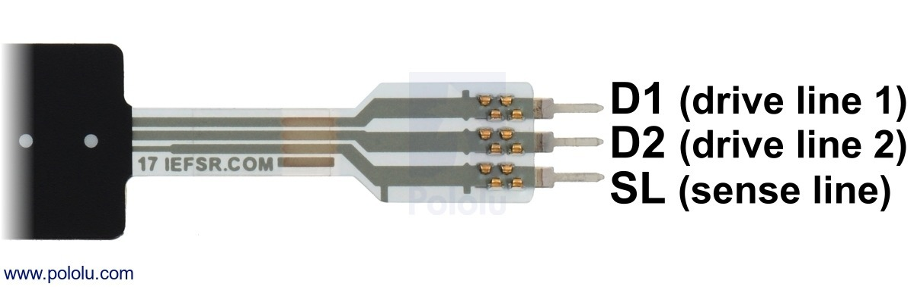
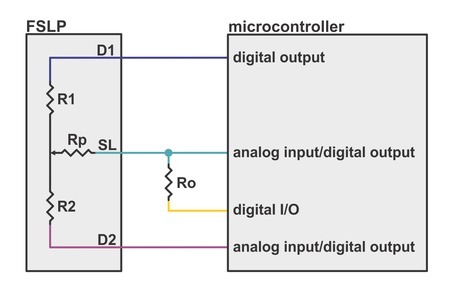
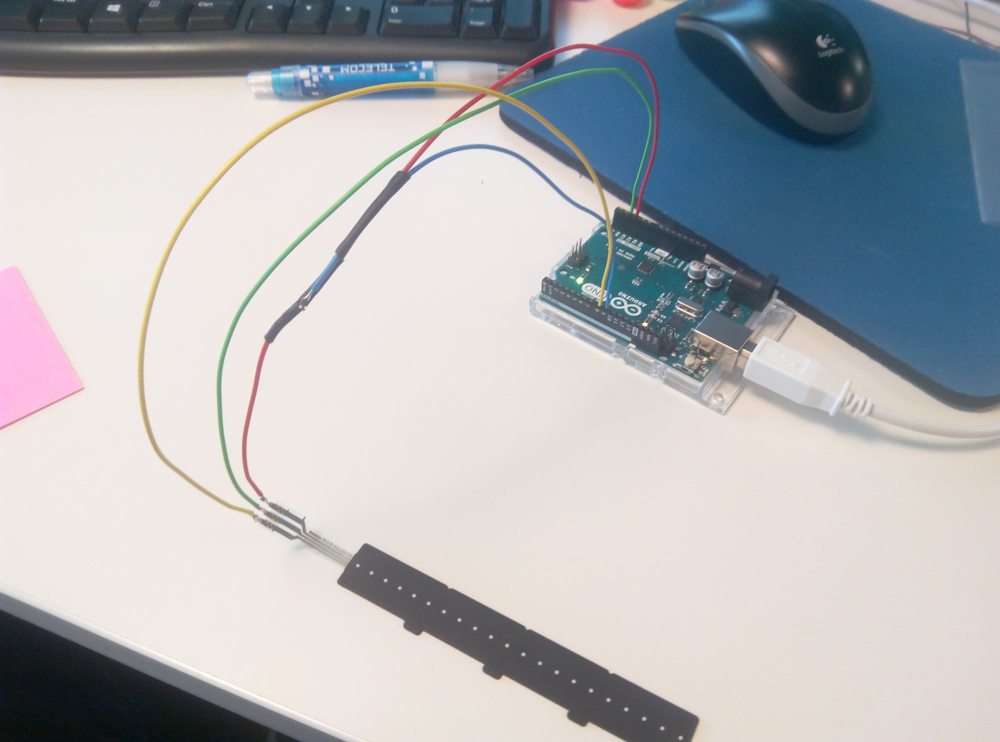

# FSLP test

## Install tools

To compile and upload program, some tools are required : 

```bash
$ # Install toolchain
$ sudo apt-get install avrdude arduino
$
$ # Get submodule
$ git submodule update --init
$
$ # Install node tools
$ npm install
```

## Link

Using example from [https://github.com/pololu/fslp-led-strip-arduino-demo](https://github.com/pololu/fslp-led-strip-arduino-demo).

Information about sensor : [https://www.pololu.com/product/2730](https://www.pololu.com/product/2730)

## Example

Main program just get value (pressure and position) and send it to user (using Serial).

Library of fslp sensor is in `fslp.hpp` and `fslp.cpp`

Pololu website show how to connect FSLP sensor : 




Solder wire on fslp sensor like this :

* Red wire : SL
* Blue wire : Bot R0 = 4.7k
* Green wire : D2
* Yellow wire : D1



## Result

Sensor is split in 4 parts. I do measure on each part (change position or force).

### Measure on first part

#### Measure with low pressure

```bash
pressure:     8   position:   126                                               
pressure:    10   position:   149                                               
pressure:     9   position:   270                                               
pressure:     7   position:   441                                               
pressure:     4   position:   524                                               
pressure:     4   position:   600                                               
pressure:     5   position:   620                                               
pressure:     5   position:   623                                               
pressure:     4   position:   691                                               
pressure:     4   position:   818                                               
pressure:     4   position:   872                                               
pressure:     7   position:   939                                               
pressure:     9   position:   962
```

#### Measure with middle pressure

```bash
pressure:     3   position:    72                                               
pressure:    14   position:   102                                               
pressure:    14   position:   104                                               
pressure:    17   position:   110                                               
pressure:    24   position:   118                                               
pressure:    31   position:   130                                               
pressure:    33   position:   131                                               
pressure:    42   position:   303                                               
pressure:    50   position:   409                                               
pressure:    49   position:   428                                               
pressure:    40   position:   505                                               
pressure:    36   position:   876                                               
pressure:    41   position:   898                                               
pressure:    42   position:   911                                               
pressure:    35   position:   979                                               
pressure:    44   position:   993                                               
pressure:    23   position:   990 
```

#### Measure with high pressure

```bash
pressure:     0   position:     0                                               
pressure:    34   position:   111                                               
pressure:    79   position:   110                                               
pressure:   104   position:   112                                               
pressure:   120   position:   124                                               
pressure:   125   position:   125                                               
pressure:   132   position:   181                                               
pressure:   174   position:   383                                               
pressure:   173   position:   395                                               
pressure:   166   position:   410                                               
pressure:   149   position:   509                                               
pressure:   153   position:   710                                               
pressure:   142   position:   733                                               
pressure:   151   position:   910                                               
pressure:   148   position:   931                                               
pressure:   150   position:   974                                               
pressure:   156   position:   979                                               
pressure:   159   position:   982                                               
pressure:   161   position:   977                                               
pressure:     0   position:     0
```

### Measure on second part

#### Measure with low pressure

```bash
pressure:     0   position:     0                                               
pressure:     2   position:   925                                               
pressure:     6   position:   986                                               
pressure:     7   position:   988                                               
pressure:     8   position:   991                                               
pressure:    11   position:   996                                               
pressure:    12   position:   997                                               
pressure:    10   position:   996                                               
pressure:     9   position:   996                                               
pressure:    10   position:   997                                               
pressure:    10   position:   995                                               
pressure:    12   position:   998                                               
pressure:    11   position:   997                                               
pressure:    11   position:   996                                               
pressure:    11   position:   997                                               
pressure:     8   position:   995                                               
pressure:    10   position:   997                                               
pressure:    13   position:   999                                               
pressure:     5   position:   986                                               
pressure:     0   position:     0
```

#### Measure with high pressure

```bash
pressure:     0   position:     0                                               
pressure:     9   position:   998                                               
pressure:    65   position:  1002                                               
pressure:    91   position:  1001                                               
pressure:    92   position:  1001                                               
pressure:    84   position:  1001                                               
pressure:    97   position:  1000                                               
pressure:    96   position:  1002                                               
pressure:    93   position:  1002                                               
pressure:    89   position:  1001                                               
pressure:    71   position:  1001                                               
pressure:    71   position:  1001                                               
pressure:    76   position:  1002                                               
pressure:    79   position:  1002                                               
pressure:    83   position:  1001                                               
pressure:    80   position:  1001                                               
pressure:   119   position:  1002                                               
pressure:   140   position:  1002                                               
pressure:    70   position:  1002                                               
pressure:     0   position:     0
```

### Measure on forth part

#### Measure with low pressure

```bash
pressure:     0   position:     0                                               
pressure:     1   position:   875                                               
pressure:     4   position:   985                                               
pressure:     6   position:   991                                               
pressure:     8   position:   997                                               
pressure:     5   position:   991                                               
pressure:     6   position:   997                                               
pressure:     8   position:   999                                               
pressure:     5   position:   992                                               
pressure:     2   position:   980                                               
pressure:     0   position:     0
```

#### Measure with high pressure

```bash
pressure:     0   position:     0                                               
pressure:     0   position:     0                                               
pressure:    55   position:  1002                                               
pressure:    93   position:  1002                                               
pressure:    91   position:  1003                                               
pressure:    86   position:  1001                                               
pressure:    73   position:  1002                                               
pressure:    73   position:  1003                                               
pressure:    74   position:  1002                                               
pressure:    81   position:  1003                                               
pressure:    85   position:  1001                                               
pressure:    15   position:  1003                                               
pressure:    13   position:  1002                                               
pressure:     7   position:  1000                                               
pressure:     0   position:     0
```

### Conclusion

The measure is good in first part, but if we are in other part, I can't get position. May be I have bad resistance ...

The pressure measure is better than position, but the amplitude is better in first zone than the others.
